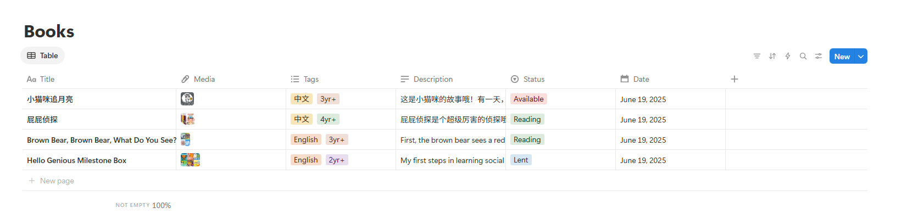

# 📚 KiddoStuff · 亲子图书共享小站

一个为亲朋好友设计的温馨小书库网站，让大家轻松查看可借图书、筛选标签、选书并一键发邮件申请借阅。后端使用 Notion 数据库作为存储，前端使用 React 构建，支持响应式浏览体验。

---

## ✨ 项目亮点

- 🧠 **智能标签筛选**：支持多标签过滤
- 📩 **一键借书**：选中图书后生成邮件链接
- 🖼️ **图书封面展示**：视觉直观、书籍信息完整
- 🔐 **安全后端集成**：通过 Node.js 与 Notion API 通信，环境变量不暴露

---

## 🖥️ 项目结构
```
KiddoStuff/
├── public/ # 静态资源
├── src/ # React 前端代码
│ ├── components/ # React 组件
│ ├── hooks/ # React hooks
│ └── App.jsx
├── server/ # 后端 Node.js Express 服务
│ ├── server.js
│ └── .env # 存储 NOTION_API_KEY 和 DATABASE_ID
└── README.md
```

## 🚀 快速启动本地开发

确保你已安装 Node.js 和 npm。

### 1. 克隆代码仓库

```bash
git clone https://github.com/YingXue/KiddoStuff.git
cd KiddoStuff
```

### 2. 安装依赖（前端和后端）
```
# 安装前端依赖

cd src
npm install

# 安装后端依赖
cd ../server
npm install
```

### 3. 添加环境变量
在 server/ 文件夹下创建 .env 文件，内容如下：
```
NOTION_API_KEY=your_notion_integration_secret
NOTION_DATABASE_ID=your_database_id
```
可以连接你自己整理的数据库


### 4. 启动开发服务器
```
# 启动后端服务
cd server
node index.js

# 启动前端（在另一个终端）
cd src
npm run dev
```
前端默认运行在 http://localhost:5173，后端运行在 http://localhost:3000。

🤝 致谢
感谢 Notion 提供的 API 服务，感谢朋友们共同参与图书整理 ❤️

📜 License
MIT © YingXue